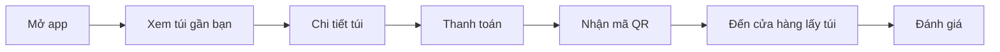
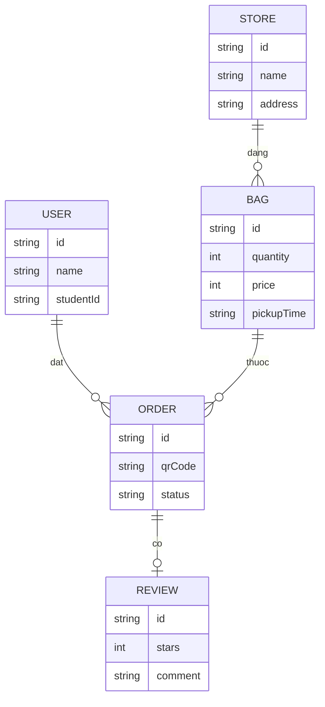
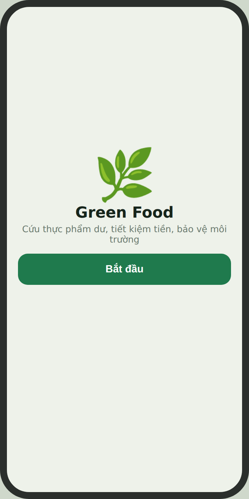
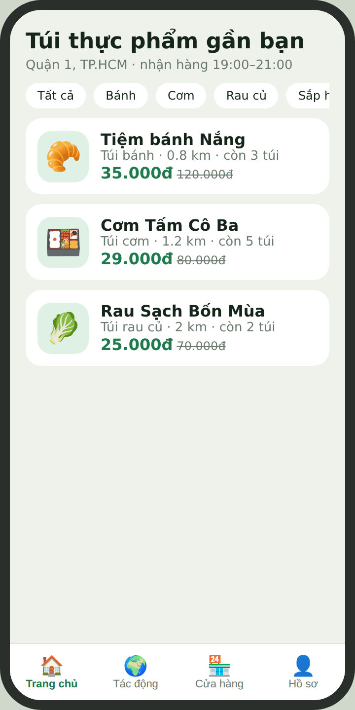
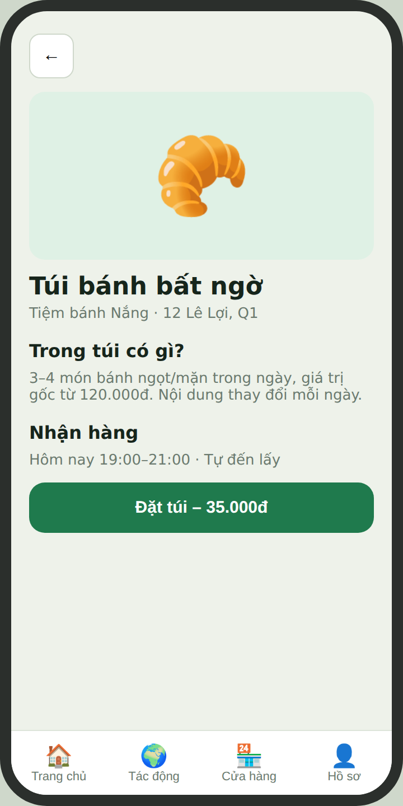
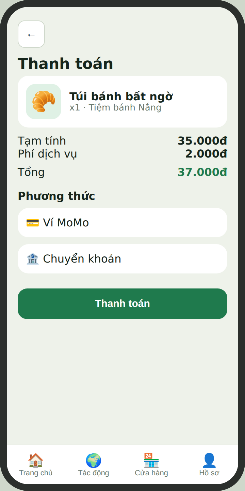
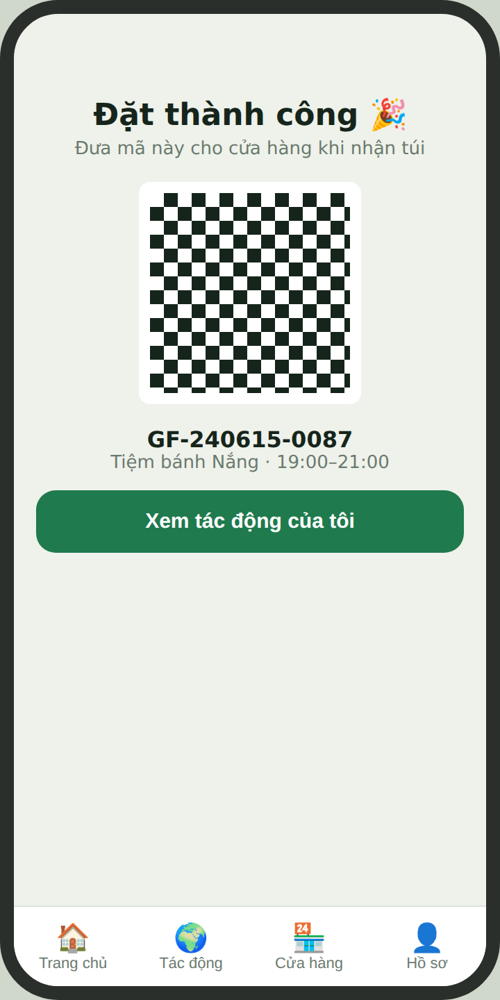
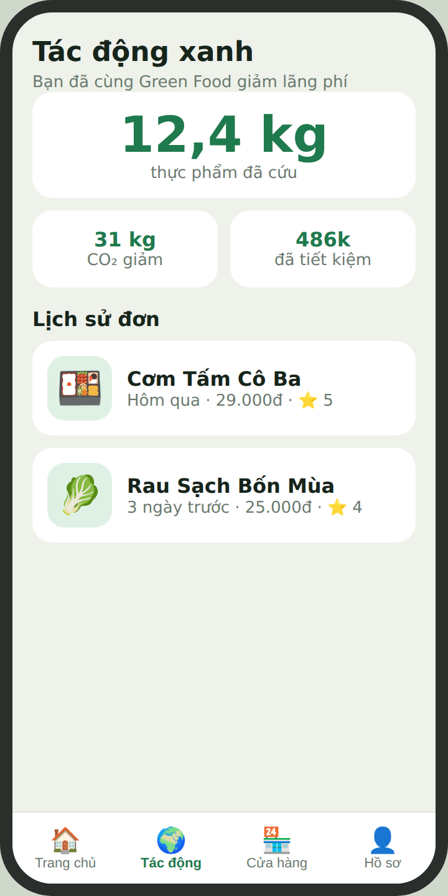
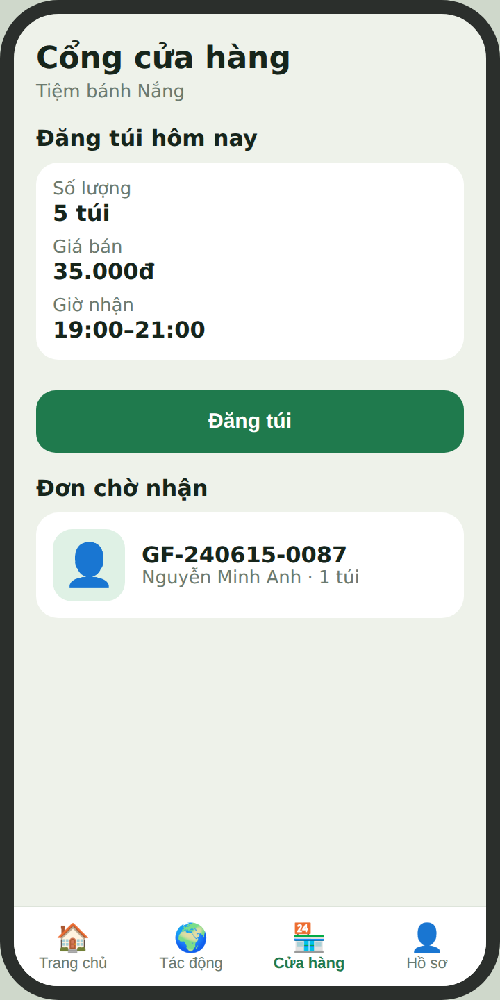
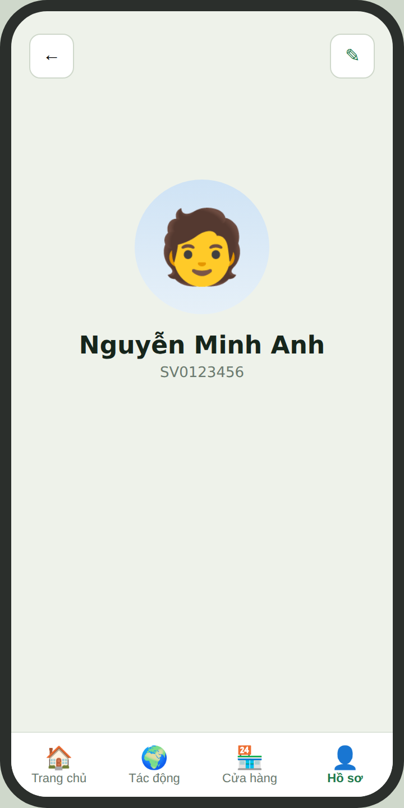

# BÁO CÁO ĐỒ ÁN MÔN HỌC – LẬP TRÌNH DI ĐỘNG
## Ứng dụng Green Food – Mua thực phẩm dư giá rẻ, giảm lãng phí

**Trường:** Đại học Giao thông Vận tải TP.HCM (UTH)
**Nhóm:** _Điền tên nhóm_ · **GVHD:** _Điền tên thầy_ · **Tuần:** 1

| STT | Họ tên | MSSV | Nhiệm vụ |
|---|---|---|---|
| 1 | _Điền tên_ | _MSSV_ | Nhóm trưởng, thiết kế UI/UX |
| 2 | _Điền tên_ | _MSSV_ | Lập trình |
| 3 | _Điền tên_ | _MSSV_ | Phân tích, tài liệu |

---

## Chương 1. Tổng quan đề tài

### 1.1 Lý do chọn đề tài
Mỗi ngày, quán ăn, tiệm bánh và siêu thị bỏ đi nhiều thực phẩm còn dùng được. Cùng lúc đó, sinh viên và người đi làm luôn tìm bữa ăn ngon, giá rẻ. Đề tài đáp ứng ba tiêu chí của giảng viên: **thực tế**, **giải quyết vấn đề cụ thể**, **có khả năng thương mại hóa**.

### 1.2 Mục tiêu
- Xây dựng ứng dụng di động cho phép người dùng đặt **túi thực phẩm bất ngờ** (surprise bag) giá rẻ từ cửa hàng gần mình.
- Giúp cửa hàng bán hết hàng dư, tăng doanh thu.
- Đo lường và hiển thị tác động xanh (kg thực phẩm cứu, CO₂ giảm).

### 1.3 Đối tượng sử dụng
| Nhóm | Mô tả | Nhu cầu |
|---|---|---|
| Người mua | Sinh viên, nhân viên văn phòng 18–35 tuổi | Ăn ngon, giá rẻ, tiện lợi |
| Cửa hàng đối tác | Quán ăn, tiệm bánh, siêu thị mini | Giảm hàng thừa, thêm doanh thu |
| Quản trị viên | Đội vận hành | Duyệt cửa hàng, theo dõi đơn |

---

## Chương 2. Phân tích thị trường và đối thủ

> Nhóm cần tự kiểm chứng lại thông tin (app nào đang hoạt động tại Việt Nam) trước khi nộp.

| Nhóm | Ví dụ | Điểm mạnh | Điểm yếu |
|---|---|---|---|
| App giao đồ ăn | GrabFood, ShopeeFood, beFood | Người dùng đông, mạng lưới rộng | Không tập trung đồ dư giá rẻ, phí ship cao |
| App cứu thực phẩm quốc tế | Too Good To Go, Olio, Flashfood | Mô hình đã được kiểm chứng | Chưa địa phương hóa cho Việt Nam |
| Siêu thị/chuỗi bán lẻ | Bách Hóa Xanh, WinMart | Có sẵn hàng, thương hiệu mạnh | Giảm giá nội bộ, không phải nền tảng chung |
| Nhóm Facebook/Zalo | Nhóm săn sale | Miễn phí, linh hoạt | Thiếu tin cậy, không thanh toán, khó kiểm soát chất lượng |

### Khoảng trống (Gap)
1. Chưa có nền tảng đồ dư giá rẻ phù hợp quán nhỏ Việt Nam.
2. Chưa có động lực xanh cho người dùng.
3. Cửa hàng nhỏ chưa có công cụ đăng bán nhanh cuối ngày.

### Điểm khác biệt của Green Food
Giá rẻ (giảm 50–70%), nhận hàng theo khung giờ cuối ngày, thanh toán trong app, mã QR xác nhận, thống kê tác động xanh.

---

## Chương 3. Phân tích yêu cầu

### 3.1 Yêu cầu chức năng
| Mã | Chức năng | Người dùng |
|---|---|---|
| FR1 | Đăng ký, đăng nhập | Người mua, cửa hàng |
| FR2 | Xem danh sách túi gần mình, lọc theo loại | Người mua |
| FR3 | Xem chi tiết túi, giờ nhận hàng | Người mua |
| FR4 | Đặt túi và thanh toán | Người mua |
| FR5 | Nhận mã QR để lấy hàng | Người mua |
| FR6 | Xem lịch sử đơn, đánh giá cửa hàng | Người mua |
| FR7 | Xem thống kê tác động xanh | Người mua |
| FR8 | Đăng túi, đặt số lượng, giá, giờ nhận | Cửa hàng |
| FR9 | Quét QR xác nhận đơn | Cửa hàng |
| FR10 | Quản lý hồ sơ cá nhân | Tất cả |

### 3.2 Yêu cầu phi chức năng
Phản hồi dưới 2 giây; bảo mật thông tin thanh toán; hỗ trợ Android 8.0+; giao diện dễ dùng bằng một tay; dữ liệu đồng bộ thời gian thực số túi còn lại.

### 3.3 Luồng đặt hàng

---

## Chương 4. Thiết kế

### 4.1 Công nghệ đề xuất
| Thành phần | Công nghệ |
|---|---|
| Ứng dụng di động | Kotlin, Jetpack Compose, MVVM |
| Backend và CSDL | Firebase (Auth, Firestore) |
| Bản đồ | Google Maps SDK |
| Thanh toán | Ví điện tử (MoMo/VNPay) |
| Thiết kế | Figma, prototype HTML |

### 4.2 Mô hình dữ liệu

### 4.3 Thiết kế giao diện
Phong cách: nền xanh nhạt, màu chính xanh lá (#1F7A4D), điểm nhấn cam (#F08A24), bo góc mềm, điều hướng dưới cùng 4 tab. Xem prototype tương tác tại `prototype/index.html`.

| | | |
|---|---|---|
|  |  |  |
| **Hình 1.** Màn hình chào | **Hình 2.** Trang chủ: túi gần bạn | **Hình 3.** Chi tiết túi |
|  |  |  |
| **Hình 4.** Thanh toán | **Hình 5.** Mã QR nhận hàng | **Hình 6.** Tác động xanh và lịch sử |
|  |  | |
| **Hình 7.** Cổng cửa hàng | **Hình 8.** Hồ sơ cá nhân | |

---

## Chương 5. Mô hình kinh doanh
| Nguồn thu | Mô tả |
|---|---|
| Hoa hồng | 15–25% mỗi đơn |
| Gói đăng ký | Miễn phí dịch vụ, ưu tiên túi hot |
| Quảng cáo | Đẩy vị trí cửa hàng |
| CSR | Hợp tác doanh nghiệp, trường học |

**Ví dụ ước tính:** 50 cửa hàng × 5 túi/ngày × 35.000đ × 20% hoa hồng ≈ 1,75 triệu đồng/ngày (≈ 52 triệu/tháng). Đây là số giả định, cần kiểm chứng bằng thử nghiệm thực tế.

**Rủi ro:** cửa hàng ít tham gia, chất lượng túi không đồng đều, an toàn thực phẩm. Cách giảm thiểu: chương trình đối tác thí điểm, hệ thống đánh giá, quy định rõ hạn dùng.

---

## Chương 6. Kế hoạch thực hiện
| Tuần | Công việc |
|---|---|
| 1 | Chọn đề tài, phân tích, thiết kế toàn bộ app |
| 2–4 | Xây dựng MVP: đăng nhập, danh sách, đặt túi, QR |
| 5–6 | Phát hành thử với vài cửa hàng, thu phản hồi |
| 7+ | Cải tiến, thêm thanh toán, thương mại hóa |

---

## Chương 7. Bài tập nghiên cứu Tuần 1

### 7.1 Mô hình giáo dục HAA
> Cần đối chiếu nguồn chính thức trước khi nộp.

Mô hình học qua dự án thực tế, có mentor từ ngành, học viên tự chủ động. **Ưu điểm:** kỹ năng thực chiến, có portfolio, học qua phản hồi thật. **Nhược điểm:** đòi hỏi tự giác cao, dễ hổng kiến thức nền, phụ thuộc chất lượng mentor, khó chuẩn hóa.

### 7.2 Internet và AI thay đổi cách tiếp cận tri thức
| | Trước Internet | Thời Internet | Thời AI tạo sinh |
|---|---|---|---|
| Tìm kiếm | Thư viện, sách, hỏi thầy | Google, YouTube, diễn đàn | Hỏi đáp trực tiếp, AI tổng hợp |
| Ghi nhớ | Học thuộc, ghi chép | "Biết chỗ tìm" | Giao cho AI, ghi nhớ ít |
| Vận dụng | Chậm, ít nguồn | Tự chọn lọc, ghép nguồn | Nhanh, rủi ro phụ thuộc và sai thông tin |

### 7.3 Cần học gì khi AI làm được gần như mọi thứ
Kiến thức nền để kiểm chứng AI, kỹ năng đặt vấn đề, thiết kế hệ thống, tư duy sản phẩm, kiểm thử và gỡ lỗi.

### 7.4 Năng lực cần phát triển
Tư duy phản biện (AI có thể sai), giải quyết vấn đề thực tế (chọn đúng bài toán), sáng tạo (tạo khác biệt), làm việc nhóm, đạo đức và trách nhiệm, học cách học.

### 7.5 Lập trình di động 10 năm tới
Vẫn phát triển theo hướng thay đổi: điện thoại vẫn là thiết bị chính, AI tích hợp trên thiết bị, AI hỗ trợ viết code nên giá trị chuyển sang thiết kế sản phẩm và trải nghiệm, thiết bị mới (đồng hồ, kính, ô tô) mở rộng phạm vi.

---

## Kết luận
Green Food giải quyết vấn đề lãng phí thực phẩm bằng một nền tảng đơn giản, có tiềm năng thương mại hóa. Tuần 1 nhóm đã hoàn thành phân tích, xác định gap, đề xuất dự án và thiết kế toàn bộ giao diện. Các bước tiếp theo là xây dựng MVP và thử nghiệm với cửa hàng thật.

## Tài liệu tham khảo
1. Slide bài giảng môn Lập trình di động, UTH.
2. Trang chủ các ứng dụng đối thủ (Too Good To Go, GrabFood, ShopeeFood…) – nhóm bổ sung link và ngày truy cập.
3. Tài liệu Android Developers: https://developer.android.com
